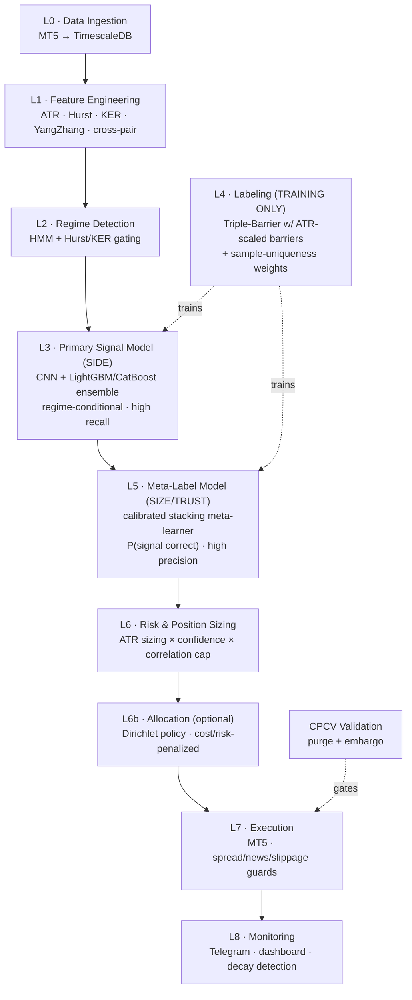

# ML-Driven Adaptive Trading System — Architecture & Strategy

**Instruments:** EURUSD, GBPUSD · **Timeframe:** H4 · **Execution:** MT5
**Stack:** Python · FastAPI · TimescaleDB · LightGBM / CatBoost / CNN · MQL5

---

## 1. Design Philosophy

The system is built on a single principle borrowed from the meta-labeling literature:

> **Don't just predict direction. Predict whether to *act*, and size the position by volatility and confidence — not conviction.**

This means the architecture is deliberately *layered and defensive*. A direction model is treated as a noisy idea generator, not an oracle. A second model decides whether each idea is worth risking capital on. Volatility decides how much. A regime layer decides which behavior is even appropriate right now. Every layer exists to either **generate edge** or **protect the cost budget** that a thin H4 edge cannot afford to leak.

The four researched pillars are not four separate systems — they are four layers of one pipeline:

| Research Pillar | Role in This System | Lands In |
|---|---|---|
| **ATR volatility risk** | Position sizing, dynamic stops, *barrier scaling* for labels | Layers 4, 6, 7 |
| **Triple-Barrier + Meta-Labeling** | Path-aware labels + a "self-trust" confidence filter | Layers 4, 5 |
| **Architecture-matched forecasting** ("no single best model") | Regime detection → regime-conditional model routing | Layers 2, 3 |
| **RL reward engineering** (Dirichlet policy, cost/risk penalties) | Capital allocation objective: `return − turnover − risk` | Layer 6b (optional) |

A critical caveat carried over from the source analysis: the research results were **marginal and unvalidated** (PPO Sharpe 0.73 vs. Buy-and-Hold 0.66 at *identical* drawdown). This architecture therefore treats edge as something to be **earned through rigorous out-of-sample validation**, not assumed. The validation layer (§6) is not an afterthought — it is the gatekeeper that decides whether any of this goes live.

---

## 2. System Architecture

### Layer 0 — Data Ingestion & Storage
- MT5 pull of OHLCV for EURUSD & GBPUSD at **H4** (primary), plus **D1** (regime context) and **M15** (execution context).
- **Tick/spread history** stored alongside bars — non-negotiable, because realistic cost modeling depends on it.
- TimescaleDB hypertables + continuous aggregates for fast feature windows. Single source of truth for both training and live inference (eliminates train/serve skew).

### Layer 1 — Feature Engineering
- **Volatility block:** ATR (multiple lookbacks), Yang-Zhang volatility, realized vol, ATR-percentile (regime context).
- **Trend/memory block:** Hurst exponent, Kaufman Efficiency Ratio (KER), MF-DFA — these distinguish trending vs. mean-reverting structure (the FX translation of "rhythmic vs. chaotic signal").
- **Cross-pair block:** rolling EURUSD↔GBPUSD correlation, spread/ratio features, lead-lag — the cross-variate insight applied to two correlated majors sharing USD risk.
- **Session block:** Asian / London / NY session dummies and session-relative volatility (you already know H4 bars behave very differently by session).
- Strict point-in-time discipline: every feature computed only from data available at bar close.

### Layer 2 — Regime Detection *(synthesis of "no single best model")*
The forecasting research's real lesson — match the model to the signal's character — becomes a **regime router** here rather than one monolithic model.
- **HMM** classifies the current state: `trending` / `ranging` / `high-volatility-shock`.
- **Hurst / KER gating** as a fast confirmation overlay (e.g., Hurst > 0.55 + high KER → trend regime).
- Output is a regime label + probabilities that condition Layer 3 and Layer 6. In a shock regime, the system can be configured to **stand down entirely** — the single biggest protection against the trend-blow-up risk that kills naive strategies.

### Layer 3 — Primary Signal Model (SIDE)
- Predicts **direction only** (long / short / flat).
- Your **CNN + LightGBM/CatBoost ensemble** as the backbone.
- **Regime-conditional:** model weights (or separate sub-models) are selected by Layer 2 — e.g., momentum-leaning logic in trend regimes, mean-reversion-leaning logic in ranging regimes. *(This is exactly where a PatchTST member could earn weight in cyclical regimes and an SSM/Mamba member in chaotic regimes if you later extend the ensemble — see Roadmap v2.)*
- Tuned for **high recall** — its job is to surface every plausible opportunity. Precision is delegated downstream.

### Layer 4 — Labeling *(training-time only)*
- **Triple-Barrier Method** with barriers set as **ATR multiples**, not fixed pips — this is the explicit join between the ATR pillar and the labeling pillar. Upper = TP, lower = SL, vertical = timeout → neutral label.
- **Sample-uniqueness weighting** to handle overlapping H4 labels — directly defends against the label-leakage failure mode that quietly inflates backtests.
- Optional **trend-scanning** labels (slope t-value) as a complementary target for the trend-regime sub-model.

### Layer 5 — Meta-Label Model (SIZE / TRUST)
- The "self-trust" layer. Takes the primary signal **plus** regime, volatility, and recent-performance features, and predicts **P(primary signal is correct)**.
- Your **calibrated stacking meta-learner** — calibration (Platt / isotonic) is essential so the probability is usable as a *sizing input*, not just a classifier output.
- Tuned for **high precision** — it filters false positives, which is what actually protects the cost budget. A signal only proceeds if P ≥ threshold τ (τ tuned on cost-adjusted, baseline-relative performance).

### Layer 6 — Risk & Position Sizing
- **Base size:** `Position Size = (Risk per trade) / (ATR × multiplier)` — constant dollar risk, auto-shrinking when volatile.
- **Confidence scaling:** multiply base size by a function of the calibrated meta-probability (a fractional-Kelly-style mapping, capped to avoid over-betting on miscalibration).
- **Correlation cap:** because EURUSD & GBPUSD share USD exposure, cap aggregate currency risk so two correlated longs don't become one oversized bet — this is the RL "covariance risk penalty" implemented as a hard risk gateway.
- **Volatility targeting** at portfolio level + a **max-drawdown circuit breaker** that de-risks or halts on breach.

### Layer 6b — Allocation *(optional, advanced)*
For 2 instruments, full RL portfolio optimization is **overkill** — the §6 rules capture most of the value. But the **reward-engineering philosophy** is the correct objective for any allocator:

> maximize `log-return − turnover_penalty − risk_penalty`

If/when the universe grows (Roadmap v3), promote this to a **Dirichlet-policy PPO agent** that allocates across pairs and sub-strategies under a native simplex constraint (weights sum to 1, no negative weights). Until then, keep it as the explicit objective function behind the §6 sizing rules.

### Layer 7 — Execution
- MT5 order placement with **pre-trade guards**: skip if spread > threshold, skip inside high-impact news windows (NFP, ECB, BoE, FOMC), enforce max slippage.
- Order management: partial-fill handling, retry logic, idempotent order IDs.
- These guards are where a thin H4 edge is defended at the point of contact.

### Layer 8 — Monitoring & Lifecycle
- **Telegram** alerts for fills, breaches, and regime flips; live **dashboard** (your VENUS-X terminal).
- **Model-decay detection:** rolling cost-adjusted Sharpe and meta-model calibration drift → automatic retraining triggers.
- Full trade journaling back into TimescaleDB for continuous CPCV refresh.

---

## 3. Training-Time vs. Inference-Time Paths

Keeping these separate prevents the most common silent backtest inflation.

**Training path:** `L0 → L1 → L4 (triple-barrier labels + weights) → L2/L3 (fit primary) → L5 (fit meta on primary's out-of-fold predictions) → §6 (CPCV)`

**Inference path:** `L0 → L1 → L2 (regime) → L3 (side) → L5 (trust prob) → L6 (size) → L6b (allocate) → L7 (execute) → L8 (monitor)`

Note: **Triple-Barrier and CPCV exist only in training.** ATR sizing, meta-gating, and the execution guards run live. The meta-model must be trained on the primary model's **out-of-fold** predictions, never in-sample, or the trust layer learns nothing real.

---

## 4. Risk Management Stack (consolidated)

1. **Regime stand-down** (L2) — no trading in shock regimes; primary defense against one-sided-trend blow-ups.
2. **ATR dynamic stops** (L7) — stops scale with volatility (H4 swing ≈ 2.0–3.0× ATR), reducing whipsaw.
3. **Volatility-scaled sizing** (L6) — constant dollar risk regardless of market noise.
4. **Confidence gating** (L5) — only trade signals the meta-model trusts.
5. **Correlation cap** (L6) — bounded aggregate USD/EUR/GBP exposure.
6. **Circuit breaker** (L6) — hard de-risk / halt on drawdown breach.
7. **Execution guards** (L7) — spread, slippage, and news filters.

---

## 5. Validation Protocol (the gatekeeper)

This is what separates a sound design from a profitable system. Nothing reaches Layer 7 without clearing it.

- **CPCV (Combinatorial Purged Cross-Validation)** with **purging + embargo** around each test fold to kill leakage from overlapping H4 labels.
- **Baseline-relative evaluation:** every metric reported *against* the majority-class baseline, Buy-and-Hold, and a random-entry control — never in isolation. (The source PPO "edge" looked far weaker once read against its own Buy-and-Hold baseline.)
- **Cost-adjusted metrics:** Sharpe/Sortino computed **after** realistic spread + commission + modeled slippage. An edge that only exists gross is not an edge.
- **Deflated Sharpe Ratio** to discount for the number of configurations tried (multiple-testing honesty).
- **Walk-forward** confirmation on a held-out, never-touched period before any live capital.

**Go/No-Go rule:** live only if cost-adjusted, baseline-relative, deflated performance holds across folds *and* walk-forward. Otherwise, back to the drawing board — not to a bigger position.

---

## 6. Key Formulas & Parameters

| Element | Definition / Default |
|---|---|
| **ATR** | max( H−L, \|H−C_prev\|, \|L−C_prev\| ), smoothed |
| **Position size** | `Risk_per_trade / (ATR × multiplier)` |
| **ATR stop multiplier (H4 swing)** | 2.0–3.0× |
| **Triple-barrier** | TP = +k·ATR, SL = −k·ATR, vertical = N bars → timeout/neutral |
| **Meta-label gate** | trade iff `P(correct) ≥ τ`; τ tuned on cost-adjusted CV |
| **Confidence sizing** | `base_size × f(P)`, fractional-Kelly, capped |
| **Allocation objective** | maximize `log-return − λ₁·turnover − λ₂·risk(covariance)` |
| **Regime trigger (example)** | trend if Hurst > 0.55 & high KER; shock → stand down |

---

## 7. Phased Implementation Roadmap

**v1 — Core edge (build first)**
L0–L1 pipeline → triple-barrier labeling (ATR-scaled) + uniqueness weights → primary ensemble → calibrated meta-model → ATR sizing + correlation cap → MT5 execution with guards → CPCV gate. Two pairs. Prove a cost-adjusted, baseline-beating edge before adding anything.

**v2 — Architecture matching**
Add deep TS members to the primary ensemble (patch-based for cyclical regimes, SSM/Mamba for chaotic regimes), weighted by Layer 2. Add automated decay detection + retraining.

**v3 — Allocation & scale**
Expand the universe (e.g., USDJPY, XAUUSD), promote Layer 6b to a Dirichlet-policy PPO allocator with the cost/risk-penalized reward. Only worthwhile once there are enough instruments for allocation to matter.

---

*Honesty note: this is a sound, defensible **design** — not a guarantee of profit. The researched results it draws from were marginal and unverified. Whether this system has a real edge is a question that only the Layer-8/§5 validation can answer. Build the validation harness first; it will save you from your own backtests.*
